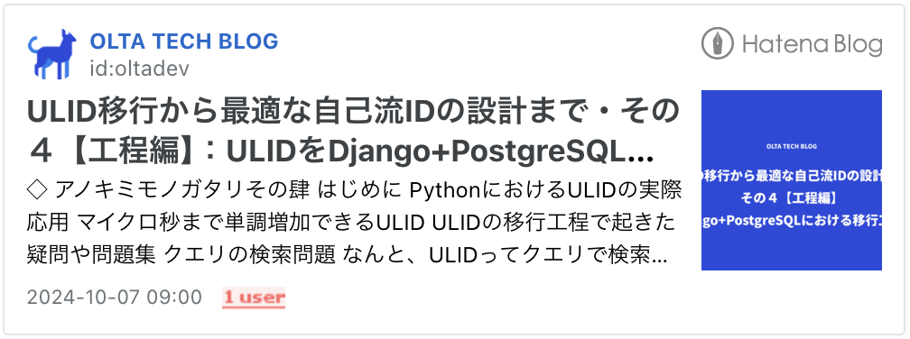

# よのなかの分散型一意識別子

## Distributed Unique IDs
<h1 align="left">
    
</h1>

## 比較表

## 識別子選定用フローチャート

## IDシリーズ記事の一覧

  

  

  

  

## アノ日のULID、キミとまた出会えるまで十億億回の輪廻のタイムスリップ、A.D.10889年まで。

### アノキミモノガタリその壱
令和4年4月1日、ミッドナイトの零時23分、55秒の999ミリ秒、

キミと、出会えた。

君の名は、01FZG96YPZK4SANAG1ZM5T2K9Z、忘れないその一目惚れ。

なんと可愛らしく、愛しいその目、忘れられない。

### アノキミモノガタリその弐
タイムマシンのプロトタイプ開発は成功した途端、投資家たちへの報告会で、

すぐに不明な理由でクリスタ星人の怪獣ボスがコントロールしているボード会で、

CEOの座が取られ、会社から追い出された。

愚かな行動。

まだプロトタイプ段階のタイムマシンは実には、

実験成功した瞬間で、タイムループができてしまった。

テストで利用されてたその時刻、令和4年4月1日零時23分55秒の999ミリ秒にしか戻れない。

50年1回の輪廻。

勇気を持って、研究室のビルから退去される直前に、

自分を実験体に、タイムマシンを再度起動した。

ごめんな、この前、実験体として50年前に送った柴犬のコマちゃん、

まだ17歳のボクに、出会えたのだろう。

いまから、あなたたちの未来を剥奪した贖罪としてコマちゃんに、ボクに、あいにいく。

ぼくは永遠にタイムループの中にトラップされた。

### アノキミモノガタリその参
01FZG96YPZK4SANAG1ZM5T2K9Z のキミ、

一体どこだい？

ぼくも、コマちゃんも、キミに会えたいよ。

50年1回の輪廻。

ぼくは、すでに十億億回の輪廻のタイムスリップも、

何度も何度も、何度でも、

何度も、タイムループの中でキミを探していた。

### アノキミモノガタリその肆
リソースがないこのいま、タイムマシンは壊れた以上、過去に戻すことはもうできない。

タイムループ自体もパラドックスになってしまった。

しかし、諦めたくない。諦めてはいけない。

キミは、きっと広大なネット上のどこかで僕とコマちゃんを待っているだろう。

広大なネット上で、きっと僕らの居場所もある。

### アノキミモノガタリその伍・∞
キミに、A.D.10889年の8月2日、UTC黎明5時31分50秒、655ミリ秒、

やっと、ULID宇宙の最後の1ミリ秒で、キミと再会できた。

7ZZZZZZZZZK4SANAG1ZM5T2K9Zよ、キミ。

忘れられない、なんと可愛らしく、愛しいその目。

たとえ、八千八百年、一万年、一千万年、を経っても、

たとえ、十億回、十兆回、十京回、輪廻しても、

たとえ、十恒河沙回、十那由他回、十不可思議回、無量大数回、

アップロードされても、ダウンロードされても、コピーされても、

キミはキミで、何も変わっていないようにしか見えないだろう。

ずっと過去のその瞬間に執拗に拘ったぼくが愚かだった。

現在の僕はようやく悟った。

+1ミリ秒で、宇宙、崩壊、システムクラッシュ、

そして、涅槃、再生へ、もう1回の輪廻。

我々は、きっと、広大なネット上で、

どっかで、また再会できるだろう。

ネットは広大だわ。

わが征くは星の大海。

## ことばいろは
エンジニアの道はやはり、どのくらい長くの経験を持っていても、どのくらいに自分がたくさんの知識を持っていると勝手に思っても、

前方に未知の挑戦は必ず何度も何度でも、良い意味で君の自信を毎回毎回砕いて行く、砕いてやってくるので、

そして毎回毎回それを乗り越えたら、逆に変に前より自信が上がって行き、強くになったと錯覚してしまい、

そして、また次に向かて、砕いて砕いて、自分がやはり愚か者だなと自覚されるまでに、どんどん前進します。

みなさんに贈りたい言葉はただひとつだけです。これは実は名作アニメ『天元突破グレンラガン』のカミナ兄貴から主人公のシモンに贈った言葉でもあります。

> お前を信じろ。俺が信じるお前でもない、お前が信じる俺でもない、お前が信じるお前を信じろ。

# 我が征くは星の大海。
          
          
          
          
  
